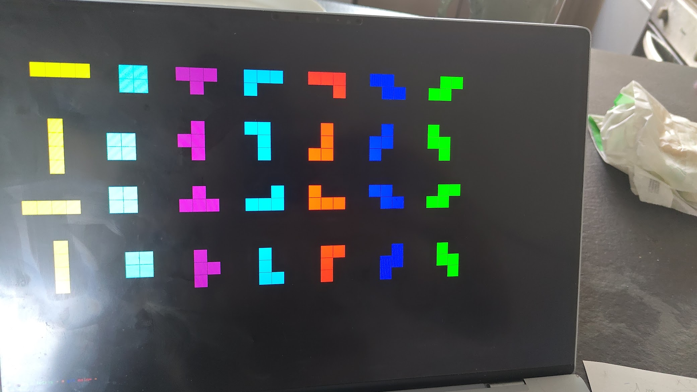

# Tetris in C without lib

The project is to build a tetris game, in C, without much libraries. Allowed
the C stdlib and linux system call, and all graphical will be done by using
direct access to linux framebuffer.

# Run

Run `nix run` in a linux terminal (not under X).

# Current state

It can display the different pieces

